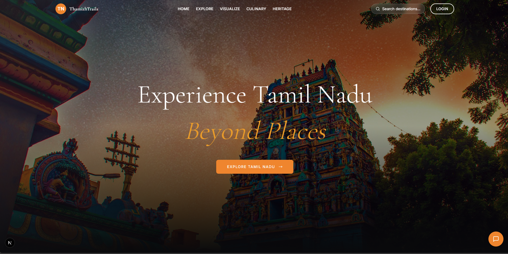
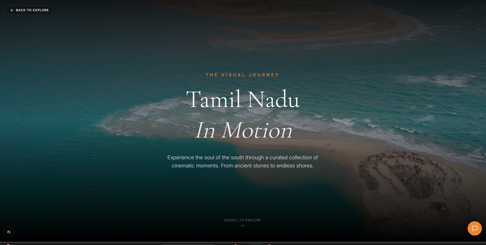
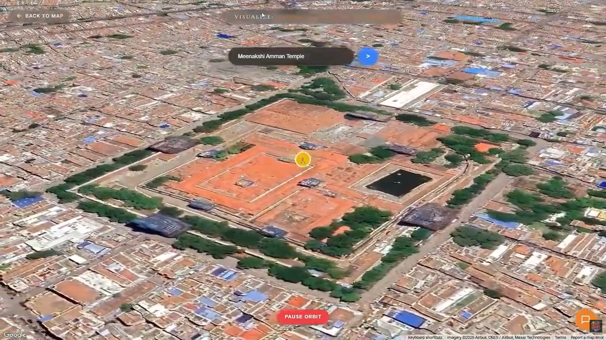

# 🌍 ThamizhTrails  
### AI-Powered Community Travel Platform for Sustainable Tourism in Tamil Nadu

---

## 📌 Problem

Tourism in Tamil Nadu is concentrated around a few major destinations, leading to:

- Overcrowding  
- Infrastructure strain  
- Poor visitor experience  
- Uneven revenue distribution  

Local communities such as artisans, SHGs, farmers, and women-led businesses often remain excluded from tourism-related income.

---

## 💡 Solution

**ThamizhTrails** is a community-driven, AI-powered travel platform that:

- 🧠 Monitors real-time crowd density  
- 🔁 Suggests alternative lesser-known destinations  
- 🎯 Provides personalized travel recommendations  
- 🤝 Connects tourists with certified local communities  
- 🌱 Promotes sustainable and inclusive tourism  

We focus on **experiences over transactions**, ensuring tourism revenue stays within local communities.

---

## 🌟 Key Features

- AI-based crowd intelligence  
- Smart rerouting from congested areas  
- Local livelihood integration  
- Cultural hotspot discovery  
- Fair tourist distribution  

---

## 🛠 Tech Stack

### Frontend
- HTML  
- CSS  
- JavaScript  

### Backend
- Node.js  
- Express.js  

### Database
- MongoDB  

---

## 📸 Project Screenshots

  

  

  

---

## 💰 Revenue Model

- Commission from local businesses  
- Cultural event partnerships  
- Government tourism collaborations  
- Tourism analytics for policy insights  

---

## 🎥 Demo

🔗 https://www.youtube.com/watch?v=XfNIwYqAFRA  

---

## 👥 Team

- Rathinavel M  
- Bhargava A  
- Sanjana MS  
- Kanishka KT  

---

